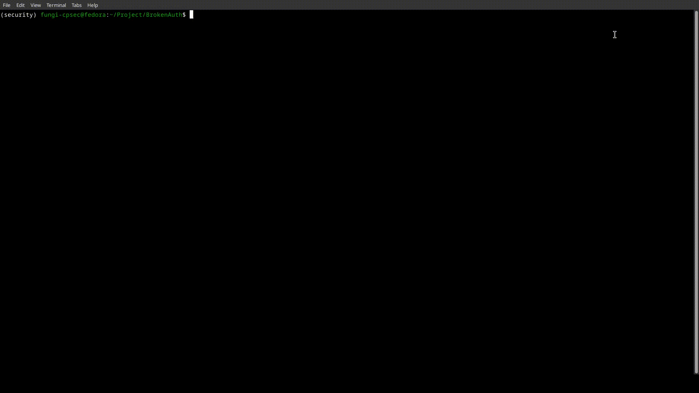

# Lazy-01

A that tool automates testing for OWASP Top 10's A01:2021 Broken Authentication by recording HTTP traffic on a specified port. This tool can modify and replay HTTP packets to test authorization for different accounts on endpoints.


# Current Features
This tool is currently under development but can still perform the following:
- Browsing activity logging
- Broken Authentication Test
- Auth Bearer token retrieval
- HTTP Packet inspection


*sample command for retrieving bearer tokens from the recorded traffic*

# Installation
I tried to use as few libraries I could to avoid unnecessary space consumption... Below are the following modules I used:

- scapy
- requests
- argparse

To install the dependencies above, simply execute the following:

```
pip3 install -r requirements.txt
```

